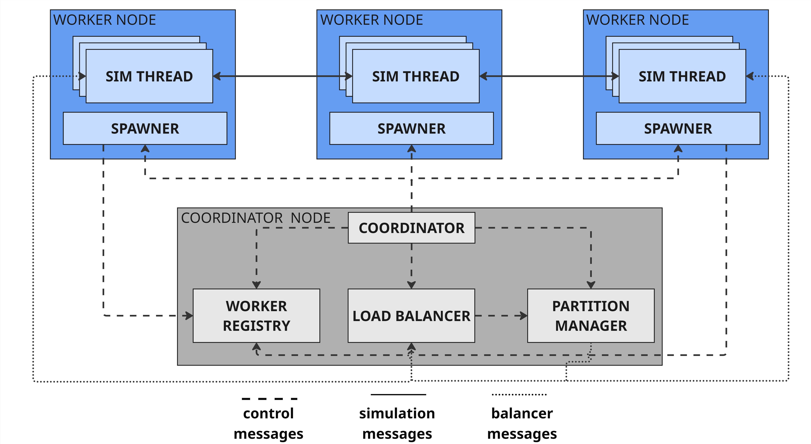

# Distributed SUMO with Dynamic Load Balancing
This repository provides a reference implementation for distributed, partitioned SUMO simulations with dynamic load balancing. It scales city-wide traffic simulations across multiple hosts to reduce overall simulation time and enable analysis in constrained environments. The system uses a virtual partitioning approach in which each partition maintains the full network state while simulating only a subset of the traffic. Partitions are assigned to spawners and coordinated through a central registry, while a Load Balancer monitors vehicle load and triggers on-the-fly migrations to correct computational imbalances.

## How to Cite
If you use this project in an academic work, please cite the repository:

```
@software{distributed_sumo_2025,
	title  = {Adaptive Distributed Traffic Simulation with Virtual Partitioning in SUMO},
	author = {Calvio, Alessandro and Sabbioni, Andrea and Bujari, Armir and Foshini, Luca},
	year   = {2025}
}
```

## Requirements
The system has been test on the following cluster configuration:
- Ubuntu 24.04.2 LTS
- Python 3.12
- SUMO 1.23
- 4 Core, 8GB RAM per host

## Architecture


## Architecture
- **Worker Registry** (`engine/registry.py`): Queryable registry where spawners register/unregister.
- **Spawner** (`engine/spawner.py`): Receives spawn requests, starts partition processes, and reports lifecycle events.
- **Partition Manager** (`engine/partitioning/partition_manager.py`): Builds the partition plan, tracks state channels, and injects updated partition state during balancing.
- **Simulation Threads** (`engine/partitioning/partition.py`): SUMO Thread driving managing local and border edges with inter-partition communications.
- **Load Balancer** (`engine/balancing/load_balancer.py`): Collects per-partition load, decides when to trigger migrations, and coordinates with the `PartitionManager`.

## System setup
### Install
On the host and worker nodes:
```bash
git clone <REPO_URL>
cd parallelumo

## Execute environment setup
./env_setup.sh
```

Populate the `hosts_list` file with a list of worker nodes (one per line), in the following format:
```
<username>@<worker_ip>
```
It is needed for the main script to execute scp commands towards the workers.
> Be sure that the coordinator can execute scp towards each worker in a passwordless way.


### Run
**Start the Registry on the host node** (on a reachable host):
```bash 
python3 engine/registry.py
```

**Start one or more Spawners** (on worker nodes):
```bash
source .venv/bin/activate
SPAWNERIP=<worker_ip> REGISTRYIP=<registry_ip> \
python engine/spawner.py
```

**To run a partitioned simulation** (from the coordinator node):
```bash
source .venv/bin/activate
NUM_PARTITIONS=<num-partitions> SIM_TIME=<max-sim-time> \
ROUTE_FILE=/path/to/routes.rou.xml \
HOST_IP=<coordinator_ip> REGISTRYIP=<registry_ip> \
python engine/main.py

## Example
# NUM_PARTITIONS=2 SIM_TIME=1500 ROUTE_FILE=$PROJECT_FOLDER/simulations/manhattan_A/random_trips_3600_id10.rou.xml SIM_FOLD=$PROJECT_FOLDER/simulations/manhattan_A HOST_IP=<192.168.1.1> REGISTRYIP=192.168.1.2 python engine/main.py
```

**To run a partitioned simulation with load balancer enabled** (from the coordinator node):
```bash
source .venv/bin/activate
NUM_PARTITIONS=<num-partitions> SIM_TIME=<max-sim-time> \
ROUTE_FILE=/path/to/routes.rou.xml \
HOST_IP=<coordinator_ip> REGISTRYIP=<registry_ip> \
BALANCING=<True/False> BALANCER_UPDATE_PACE=500 BALANCING_THRESHOLD=0.20 \
python engine/main.py

## Example
# NUM_PARTITIONS=2 SIM_TIME=1500 ROUTE_FILE=$PROJECT_FOLDER/simulations/manhattan_A/random_trips_3600_id10.rou.xml SIM_FOLD=$PROJECT_FOLDER/simulations/manhattan_A HOST_IP=<192.168.1.1> REGISTRYIP=192.168.1.2 BALANCING=True BALANCER_UPDATE_PACE=500 BALANCING_THRESHOLD=0.20 python engine/main.py
```

